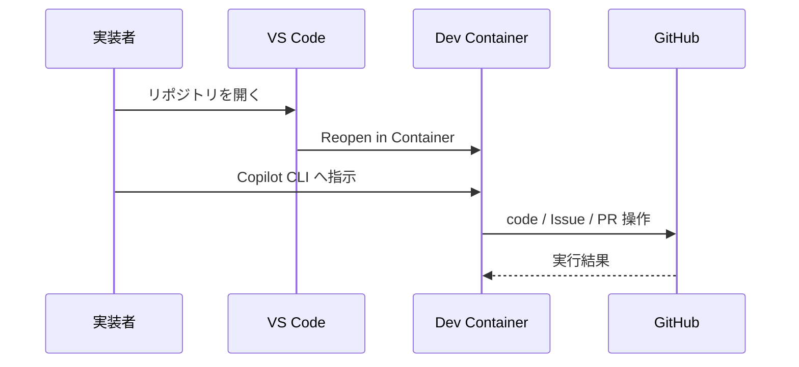

# Docker ベース GitHub Copilot CLI 開発ガイド

> 対象: 実装者 / リポジトリ管理者  
> 関連: [../README.md](../README.md), [../scripts/configure-github-guardrails.ps1](../scripts/configure-github-guardrails.ps1)

---

## 概要

このドキュメントは、GitHub からクローンしたリポジトリを VS Code で開き、GitHub Copilot CLI 相当のターミナルエージェントへ指示しながら、Docker ベースの隔離環境で作業を開始する標準フローを定義する。

### 主要なポイント

| 項目 | 内容 |
|---|---|
| 標準起動 | Clone → Open Folder → Reopen in Container |
| 実作業場所 | Dev Container 内のワークスペース |
| コンテナ内ツール | Dotnet 8 / 10、Node.js 20、PowerShell、GitHub CLI、Docker 利用前提 |
| GitHub 権限 | code / Issues / Pull Requests を操作できる権限を付与し、Administration は付与しない |
| 保護ブランチ | `main` / `develop` は reviewed PR merge を前提に保護する |

---

## 1. 実装者の標準フロー



1. GitHub から対象リポジトリをクローンする。
2. VS Code でクローン先フォルダを開く。
3. `Reopen in Container` を実行する。
4. コンテナ内ターミナルから GitHub Copilot CLI 相当のエージェントへ指示する。
5. 編集、build、test、Issue / Pull Request 操作はコンテナ内ワークスペースで行う。

## 2. Dev Container に含める前提

| カテゴリ | 内容 |
|---|---|
| .NET | `dotnet-sdk-8.0`, `dotnet-sdk-10.0` |
| Frontend | Node.js 20, npm |
| CLI | PowerShell, GitHub CLI |
| Docker | host Docker daemon を利用できる構成 |
| VS Code 拡張 | GitHub Copilot, GitHub Copilot Chat, Docker, C#, PowerShell |

## 3. GitHub 権限の考え方

### 3.1 付与する権限

| 対象 | 推奨権限 |
|---|---|
| Repository code | Contents: Read and write |
| Issues | Issues: Read and write |
| Pull Requests | Pull requests: Read and write |
| Repository metadata | Metadata: Read |

### 3.2 付与しない権限

| 対象 | 理由 |
|---|---|
| Administration | repository settings や deletion まで許可しないため |
| Repository deletion | 実装作業に不要なため |
| 保護ブランチ bypass | reviewed PR merge の統制を崩さないため |

## 4. 保護ブランチの適用

`main` と `develop` の保護は、GitHub ruleset で適用する。リポジトリ管理者は次を実行する。

```powershell
pwsh ./scripts/configure-github-guardrails.ps1 -Owner <owner> -Repo <repo>
```

このスクリプトは、少なくとも次を設定対象とする。

- reviewed Pull Request を経た変更のみ許可
- force push 禁止
- protected branch の削除禁止
- linear history の維持
- squash merge のみ許可

## 5. 自動適用の前提条件

guardrail の自動適用は、常に成功するわけではない。次の前提が満たされる場合にのみ自動化できる。

| 項目 | 前提 |
|---|---|
| GitHub 機能 | 対象リポジトリで branch protection / ruleset API が利用可能 |
| 認証 | `gh` が利用可能で、Administration 相当の更新権限を持つトークンが設定されている |
| bootstrap | `configure_copilot_guardrails=true` で生成処理を行う |

現在のリポジトリのように GitHub API が `403 Upgrade to GitHub Pro or make this repository public to enable this feature.` を返す環境では、自動保護は適用されない。その場合は、GitHub の機能提供条件を満たす構成へ切り替える必要がある。

## 6. 実装上の制約

GitHub native の ruleset では、reviewed Pull Request merge を **UI から行ったか CLI から行ったか** を区別できない。そのため、本リポジトリでは次の読み替えで運用する。

| 要件 | 実装上の扱い |
|---|---|
| direct push 禁止 | ruleset で強制する |
| reviewed PR merge の許可 | client 種別を問わず許可する |
| CLI だけを名指しで禁止 | GitHub native 単体では未対応 |

## 7. bootstrap workflow との関係

`.github/workflows/template-bootstrap.yml` の `configure_copilot_guardrails` 入力を有効にすると、新規生成リポジトリに対して guardrail 用 ruleset を自動適用できる。

## 8. 変更後の確認

```powershell
dotnet build .\templates\dotnet8\PokenaeTemplate.sln
dotnet test .\templates\dotnet8\PokenaeTemplate.Tests\PokenaeTemplate.Tests.csproj
dotnet build .\templates\dotnet10\PokenaeTemplate.sln
dotnet test .\templates\dotnet10\PokenaeTemplate.Tests\PokenaeTemplate.Tests.csproj
docker build -f .\.devcontainer\Dockerfile .
```
